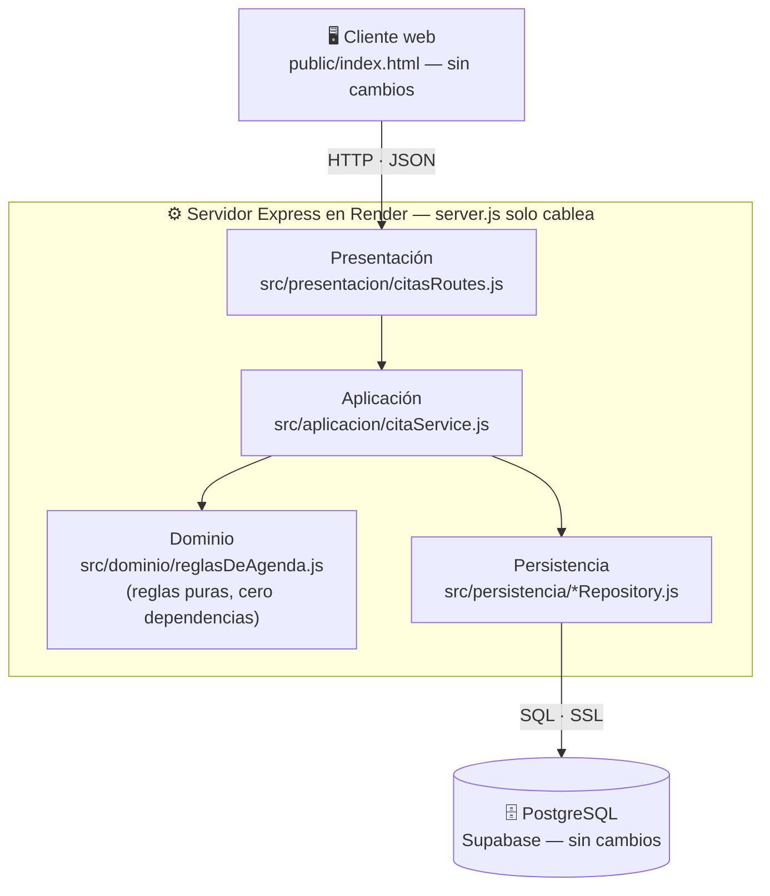

<div align="center">

# Reserva de Citas — Demo en Arquitectura de Capas

Sistema de referencia del curso **Arquitectura de Sistemas I** · Universidad Central · 2026-2

[](https://nodejs.org)
[](https://expressjs.com)
[](https://supabase.com)
[](https://render.com)

**[🌐 Demo en vivo](https://eng-demo-citas.onrender.com)** ·
**[📖 Guía de despliegue](https://eng-demo-citas.onrender.com/blog-semana-7.html)** ·
**[🔬 Detalle del refactor](docs/REFACTOR.md)**

</div>

---

Aplicación mínima que demuestra dos vistas complementarias del mismo sistema: la vista **Cliente-Servidor** (quién habla con quién por la red — Semana 7) y la vista **en capas** (cómo se organiza el servidor por dentro — Semana 8). Esta versión es la refactorización en capas del `server.js` original: el comportamiento es idéntico, el cliente y la base de datos no cambiaron ni una línea.

> **La idea central del refactor:** se reorganizó el interior del servidor sin que nadie afuera lo note. Las capas organizan responsabilidades; no agregan servidores ni cambian el contrato HTTP.

## Arquitectura en capas



La dirección de las flechas es la regla: las dependencias apuntan hacia adentro/abajo. El dominio no importa nada (`grep require src/dominio/*` devuelve cero resultados) — por eso sus reglas se pueden probar aisladas y sobrevivirían a un cambio de framework o de base de datos.

### ¿A dónde se fue cada pedazo del `server.js` original?

| En la Semana 7 estaba... | Ahora vive en... | Por qué ahí |
|---|---|---|
| Reglas de negocio (datos, fechas, agenda) | `src/dominio/reglasDeAgenda.js` | Son del negocio, no del protocolo ni de la base |
| Todos los `pool.query` (SQL) | `src/persistencia/*Repository.js` | Guardar y consultar es persistencia |
| Los códigos HTTP 400/409/500 | `src/presentacion/citasRoutes.js` | El protocolo es asunto de la presentación |
| El orden de los pasos al reservar | `src/aplicacion/citaService.js` | Coordinar casos de uso es aplicación |
| `app.listen`, middlewares | `server.js` (30 líneas) | Solo arranque y cableado |

El análisis completo, con el flujo de una solicitud y el mapa a las diapositivas del curso, está en [`docs/REFACTOR.md`](docs/REFACTOR.md).

## API — sin cambios

La API es idéntica a la de la Semana 7 (ese es el punto):

| Método | Ruta | Respuestas |
|--------|------|-----------|
| `GET` | `/api/salud` | `200` |
| `GET` | `/api/profesionales` | `200` |
| `GET` | `/api/citas` | `200` |
| `POST` | `/api/citas` | `201` · `400` datos/fecha · `409` agenda ocupada |

La diferencia: ahora el dominio lanza errores simbólicos (`FECHA_PASADA`, `AGENDA_OCUPADA`) y la presentación los traduce a códigos HTTP. El dominio nunca supo que existe HTTP.

## Estructura del proyecto

```
demo-cliente-servidor/
├── server.js                        # 30 líneas: arranque y cableado
├── src/
│   ├── presentacion/citasRoutes.js  # HTTP ↔ aplicación; decide 400/409/500
│   ├── aplicacion/citaService.js    # Casos de uso como recetas
│   ├── dominio/reglasDeAgenda.js    # Reglas puras — cero requires
│   └── persistencia/                # Único lugar con SQL y conexión
│       ├── db.js
│       ├── citaRepository.js
│       └── profesionalRepository.js
├── public/index.html                # Cliente: byte a byte igual a la Semana 7
├── db/setup.sql                     # Base de datos: sin cambios
└── docs/REFACTOR.md                 # Autopsia del refactor
```

## Ejecución local y despliegue

Idénticos a la Semana 7 — nada del despliegue cambió con el refactor:

```bash
npm install
cp .env.example .env     # cadena del Transaction pooler de Supabase
npm start                # → http://localhost:3000
```

En Render no hay que tocar nada: el mismo servicio redespliega este commit automáticamente y sigue funcionando igual. Guía completa: [blog de despliegue](https://eng-demo-citas.onrender.com/blog-semana-7.html).

## Nota sobre concurrencia

El refactor conserva deliberadamente la condición de carrera de la Semana 7 (verificar disponibilidad y luego insertar, en dos pasos, sin restricción de unicidad). Las capas organizan responsabilidades; no resuelven concurrencia — la exclusión real se garantiza en el nivel de datos con un índice de unicidad, y ese es un ejercicio de la sesión de la Semana 8.

## Ruta del curso

| Semana | Tema | Este repositorio |
|--------|------|------------------|
| **7** | Vista Cliente-Servidor | ✅ `server.js` plano + despliegue ([ver commit inicial](../../commits/main)) |
| **8** | Arquitectura en Capas | ✅ Versión actual: refactor en `src/` — mismo comportamiento |
| **9** | Reglas de dependencia | 🔜 DIP · patrón Repository · inyección de dependencias |

El diff entre las dos primeras semanas se lee en el historial de commits: en rojo el archivo único, en verde las capas.

---

<div align="center">
<sub>Universidad Central · Ingeniería de Sistemas · Arquitectura de Sistemas I · 2026-2 · Prof. Elias Buitrago Bolivar</sub>
</div>
